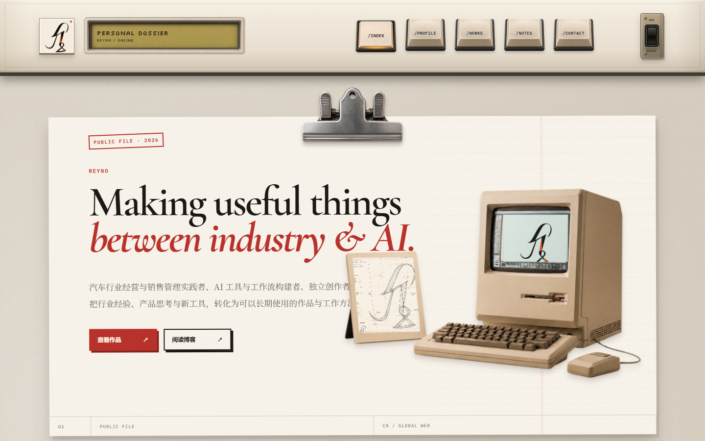
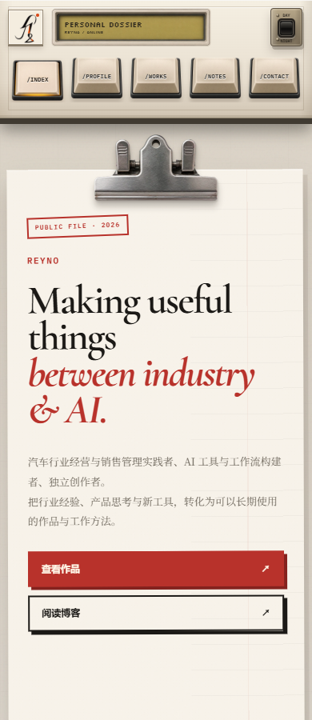

# Reyno Personal Dossier

以 [jintao.co.uk](https://jintao.co.uk/) 2026-09-12 的界面为视觉基准，使用 React、TypeScript 和 Vite 实现。保留仓库原有的 Reyno 名称，其余示例资料、项目及图片沿用参考站内容。

包含机械按键导航、日夜主题、纸张与金属夹首页、履历及 CV 弹窗、作品控制台、可通过按钮/键盘/触摸切换的软盘项目、文章时间线和打字机页脚。

## 本地运行

```sh
npm ci
npm run dev
```

打开 http://localhost:3000。

```sh
npm run lint
npm run build
npm run preview
```

生产文件输出至 `dist/`，可部署到支持静态网站的服务根路径。

## 修改内容

- `src/data.ts`：导航、作品、软盘项目和文章。
- `src/components/`：首页介绍、职业经历、页脚及交互组件。
- `src/index.css`：原站布局、颜色、字体和响应式样式。不要添加全局 CSS reset，避免改变浏览器默认字体与控件外观。
- `public/`：本地图片素材。
- `index.html`：页面标题、分享信息、字体加载及首屏主题初始化。

## CV 申请

弹窗已实现完整的 UI、输入校验、键盘焦点循环和 Escape 关闭。真实发送需要设置 `.env.local` 中的 `VITE_CV_REQUEST_ENDPOINT`，参考 `.env.example`。

接口接收 JSON POST：`name`、`email`、`organization`、`reason`、`message`、`website`（蜜罐字段）。只有返回成功 HTTP 状态、`application/json` 和 `{ "success": true }` 时才显示成功。未配置时提示申请暂未开放，不会伪装发送成功。

## 验证

已通过 TypeScript 检查和 Vite 生产构建。使用 Microsoft Edge / Playwright 检查了 1440、1024、768、390、320 像素宽度，全部图片正常加载、无横向溢出或浏览器运行错误；验证了五个导航锚点、主题持久化、软盘切换、弹窗焦点和未配置接口的反馈。

桌面端抽查 14 处元素的边界位置和尺寸，与同浏览器中参考站的测量结果一致。完整页面、夜间和手机截图已实际查看；Reyno 品牌文字与参考站不同。




